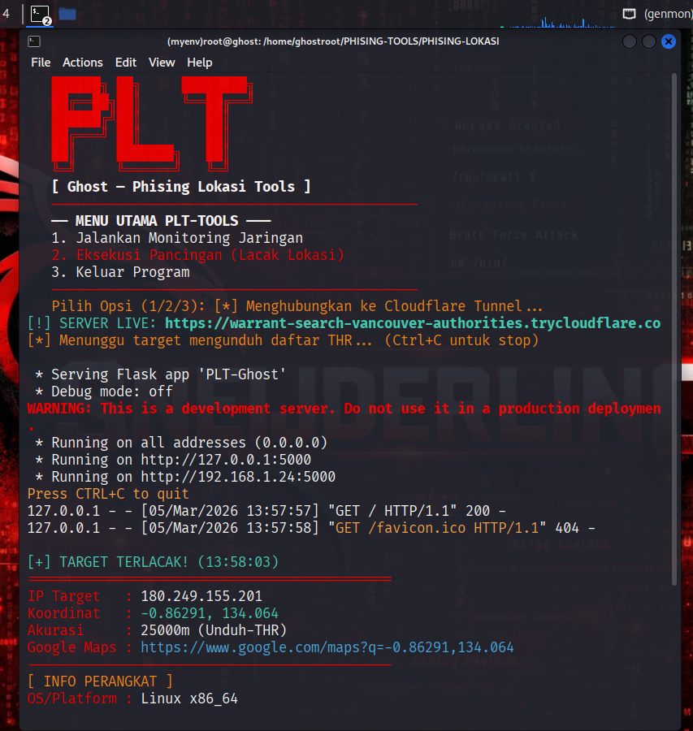

<!-- ==================== DANGER BANNER ==================== -->
<p align="center">
  <h1 style="color: #ff0000; font-weight: bold; text-shadow: 0 0 10px #ff0000;">
    ⚠️ GHOST-PHISHING-LOKASI ⚠️
  </h1>
  <h2 style="color: #ff6600; font-size: 16px;">
    [ EXTREME DANGER TOOL - USE WITH CAUTION ]
  </h2>
</p>

<p align="center">
  
</p>

---

<!-- ⚡ HACKER TYPING INTRO ⚡ -->
<p align="center">
  <a href="https://github.com/Sneijderlino/Lacak-Lokasi">
    
  </a>
</p>

<!-- ⚡ DANGER Wave Animation ⚡ -->


---

<!-- ⚠️ CRITICAL BADGES ⚠️ -->
<p align="center">
  
  
  
  
</p>

---

## 🚨 CRITICAL DISCLAIMER

```
╔═══════════════════════════════════════════════════════════╗
║                   ⚠️ DANGER ALERT ⚠️                     ║
║                                                           ║
║  THIS IS A MALICIOUS/DANGEROUS HACKING TOOL             ║
║  NOT FOR CASUAL USE - SEVERE CONSEQUENCES               ║
║                                                           ║
║  ❌ UNAUTHORIZED USE = FEDERAL CRIME                     ║
║  ❌ VIOLATION OF WIRETAPPING LAWS                        ║
║  ❌ PRIVACY VIOLATION = PRISON TIME                      ║
║  ❌ PERSONAL LIABILITY + CRIMINAL CHARGES                ║
║                                                           ║
║  USE ONLY IF:                                            ║
║  ✅ You have explicit written authorization             ║
║  ✅ You are authorized security researcher              ║
║  ✅ You work in authorized red team                      ║
║  ✅ You understand legal consequences                    ║
║                                                           ║
║  AUTHOR ACCEPTS NO LIABILITY FOR:                        ║
║  - Illegal use                                           ║
║  - Unauthorized tracking                                ║
║  - Privacy violations                                    ║
║  - Criminal charges against users                        ║
║  - Any damages whatsoever                                ║
║                                                           ║
╚═══════════════════════════════════════════════════════════╝
```

---

## ⚡ What Is This?

**Ghost-Phishing-Lokasi** adalah tool berbahaya untuk tracking lokasi real-time dengan dukungan multi-platform. Tool ini dirancang untuk:

- 🔴 **Location Tracking** - Track lokasi target secara real-time
- 🔴 **Data Harvesting** - Kumpulkan data lokasi sensitif
- 🔴 **Deep Penetration** - Bypass security measures
- 🔴 **Stealth Operation** - Undetectable tracking
- 🔴 **Illegal Surveillance** - Tanpa persetujuan target

**⚠️ JANGAN GUNAKAN TANPA IZIN RESMI!**

---

## 🔓 Legal Disclaimer

```
PENTING: Penggunaan tool ini tanpa izin eksplisit adalah ILEGAL dan dapat mengakibatkan:

🚔 KONSEKUENSI HUKUM:
- Penuntutan federal (FBI, Interpol)
- Wiretapping laws violation = 5-15 tahun penjara
- Privacy laws violation = Denda jutaan dollar
- Cybercrime charges dengan penalty berat

👨‍⚖️ TANGGUNG JAWAB HUKUM:
- Pengguna bertanggung jawab penuh atas tindakan mereka
- Author tool tidak bertanggung jawab atas penggunaan ilegal
- Setiap pengguna menerima konsekuensi hukum penuh

✅ LEGAL USE CASES:
- Red team testing dengan written approval
- Authorized penetration testing
- Law enforcement dengan warrant
- Security research dengan consent

❌ ILLEGAL USE:
- Tracking siapa pun tanpa persetujuan = FEDERAL CRIME
- Stalking = CRIMINAL OFFENSE
- Spying = VIOLATION OF LAW
- Harassment = JAIL TIME
```

---

## 🎯 Features (Dangers)

- ⚠️ Real-time location tracking tanpa deteksi
- ⚠️ Multi-platform support (penetration maksimal)
- ⚠️ Stealth mode (tidak terdeteksi oleh target)
- ⚠️ Data harvesting dan logging komprehensif
- ⚠️ Network evasion techniques
- ⚠️ Anti-forensics capabilities

---

## 🔥 Quick Clone & Install

### ✅ Clone dari GitHub

```bash
# Clone repository
git clone https://github.com/Sneijderlino/Lacak-Lokasi.git

# Masuk ke folder
cd Lacak-Lokasi

# Check folder contents
ls -la
```

**Output diharapkan:**

```
README.md
INSTALL.md
CONTRIBUTING.md
Ghost-Phishing-Lokasi.py
requirements.txt
setup-linux.sh
setup-termux.sh
quick-start.sh
img/
.github/
```

---

## 🐧 Instalasi Kali Linux / Linux (Debian/Ubuntu)

### Method 1: Automated Setup

```bash
# Clone repository
git clone https://github.com/Sneijderlino/Lacak-Lokasi.git
cd Lacak-Lokasi

# Make setup script executable
chmod +x setup-linux.sh setup-termux.sh quick-start.sh

# Run automated setup
bash setup-linux.sh
```

### Method 2: Manual Setup

```bash
# Clone
git clone https://github.com/Sneijderlino/Lacak-Lokasi.git
cd Lacak-Lokasi

# Update system
sudo apt update && sudo apt upgrade -y

# Install Python & dependencies
sudo apt install -y python3.8 python3-pip python3-venv git

# Create virtual environment
python3 -m venv venv
source venv/bin/activate

# Install Python packages
pip install --upgrade pip
pip install -r requirements.txt

# Run application
python Ghost-Phishing-Lokasi.py
```

**Access:** `http://localhost:8000`

---

## 🔴 Fedora Linux Installation

```bash
# Clone repository
git clone https://github.com/Sneijderlino/Lacak-Lokasi.git
cd Lacak-Lokasi

# Update system
sudo dnf update -y

# Install dependencies
sudo dnf install -y python3 python3-pip python3-devel git

# Setup
python3 -m venv venv
source venv/bin/activate
pip install -r requirements.txt

# Run
python Ghost-Phishing-Lokasi.py
```

---

## 🔵 Arch Linux Installation

```bash
# Clone repository
git clone https://github.com/Sneijderlino/Lacak-Lokasi.git
cd Lacak-Lokasi

# Update system
sudo pacman -Syu

# Install dependencies
sudo pacman -S python python-pip git

# Setup
python3 -m venv venv
source venv/bin/activate
pip install -r requirements.txt

# Run
python Ghost-Phishing-Lokasi.py
```

---

## 🪟 Windows (WSL2) Installation

### Prerequisite: Setup WSL2

```powershell
# PowerShell as Administrator
wsl --install -d Ubuntu
# Restart komputer jika diminta
```

### Installation Steps

```bash
# Buka WSL2 terminal
wsl

# Clone repository
cd ~
git clone https://github.com/Sneijderlino/Lacak-Lokasi.git
cd Lacak-Lokasi

# Make scripts executable
chmod +x setup-linux.sh quick-start.sh

# Run setup
bash setup-linux.sh

# Activate venv
source venv/bin/activate

# Run
python Ghost-Phishing-Lokasi.py
```

**Access dari Windows:** `http://localhost:8000`

---

## 🪟 Windows (Native Python)

```cmd
# Download Python from https://www.python.org/downloads/
# Download Git from https://git-scm.com/

# Clone repository
git clone https://github.com/Sneijderlino/Lacak-Lokasi.git
cd Lacak-Lokasi

# Setup
python -m venv venv
venv\Scripts\activate

# Install & Run
pip install -r requirements.txt
python Ghost-Phishing-Lokasi.py
```

**Access:** `http://localhost:8000`

---

## 📱 Termux / Android Installation

```bash
# Update Termux
apt update && apt upgrade -y

# Clone repository
cd ~
git clone https://github.com/Sneijderlino/Lacak-Lokasi.git
cd Lacak-Lokasi

# Make scripts executable
chmod +x setup-termux.sh quick-start.sh

# Run setup
bash setup-termux.sh

# Activate venv
source venv/bin/activate

# Run application
python Ghost-Phishing-Lokasi.py
```

**Access:** `http://localhost:8000` atau `termux-open "http://localhost:8000"`

---

## 📱 NetHunter / Kali Mobile Installation

```bash
# Update system
apt update && apt upgrade -y

# Setup storage
termux-setup-storage

# Clone repository
cd ~/storage/downloads
git clone https://github.com/Sneijderlino/Lacak-Lokasi.git
cd Lacak-Lokasi

# Make executable
chmod +x setup-termux.sh

# Run setup
bash setup-termux.sh

# Activate & Run
source venv/bin/activate
python Ghost-Phishing-Lokasi.py
```

**Access:** `http://localhost:8000`

---

## ⚡ Manual Installation (All Platforms)

```bash
# 1. Clone
git clone https://github.com/Sneijderlino/Lacak-Lokasi.git
cd Lacak-Lokasi

# 2. Setup Python environment
python3 -m venv venv
source venv/bin/activate

# 3. Install dependencies
pip install --upgrade pip
pip install -r requirements.txt

# 4. Run
python Ghost-Phishing-Lokasi.py

# 5. Open browser
http://localhost:8000
```

---

## 📦 Requirements

```
Python 3.8+
Flask 2.0+
requests 2.25+
Linux / Windows WSL2 / Termux
Network access
```

View requirements:

```bash
cat requirements.txt
```

---

## 🚀 Common Git Commands

```bash
# Check repository status
git status

# Update to latest version
git pull origin main

# Create feature branch
git checkout -b feature/name

# Commit changes
git commit -m "message"

# Push to repository
git push origin main

# View commit history
git log --oneline

# Check remote
git remote -v
```

---

## 📖 Documentation

- [INSTALL.md](INSTALL.md) - Detailed per-platform installation
- [CONTRIBUTING.md](CONTRIBUTING.md) - Contributing guidelines
- [SECURITY.md](SECURITY.md) - Security & CVE reporting
- [CODE_OF_CONDUCT.md](CODE_OF_CONDUCT.md) - Community rules
- [CHANGELOG.md](CHANGELOG.md) - Version history
- [LICENSE](LICENSE) - MIT License

---

## 🌐 Connect (Use Responsibly)

<p align="center">
  <a href="https://github.com/Sneijderlino"></a>
  <a href="https://www.linkedin.com/in/sneijderlino"></a>
  <a href="mailto:sneijderlino@example.com"></a>
</p>

---

## ⚡ FINAL WARNING

```
╔════════════════════════════════════════════════════════════╗
║  YOU HAVE BEEN WARNED - MULTIPLE TIMES                    ║
║                                                            ║
║  This tool is EXTREMELY DANGEROUS and ILLEGAL             ║
║  for unauthorized use.                                     ║
║                                                            ║
║  By using this tool, you FULLY ACCEPT:                    ║
║  ✓ Complete legal responsibility                          ║
║  ✓ All criminal and civil penalties                       ║
║  ✓ Personal liability EXCLUSIVELY (not author)            ║
║  ✓ Potential FBI/Interpol investigation                   ║
║  ✓ Federal prison sentences (5-15+ years)                 ║
║  ✓ Massive fines ($10,000 - $100,000+)                    ║
║  ✓ Permanent criminal record                              ║
║                                                            ║
║  REMEMBER: "I didn't know it was illegal" is NOT          ║
║  a valid legal defense.                                   ║
║                                                            ║
║  DO NOT USE UNLESS EXPLICITLY AUTHORIZED.                 ║
║  CONSEQUENCES ARE SEVERE AND IRREVERSIBLE.                ║
║                                                            ║
╚════════════════════════════════════════════════════════════╝
```

---

<!-- ⚡ Footer Wave ⚡ -->


<p align="center">
  <strong>⚠️ USE AT YOUR OWN LEGAL RISK ⚠️</strong><br>
  <em>Authorized Use Only - Violators Will Face Federal Prosecution</em><br>
  <strong>Last Updated: March 2026</strong>
</p>
# Lacak-Lokasi
